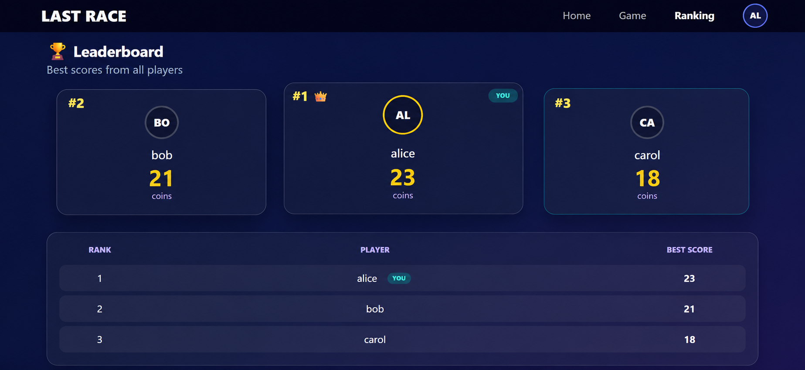
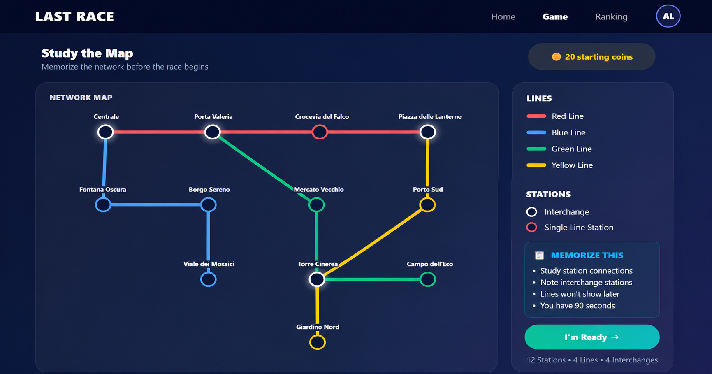

# Last Race

## Student

s356826 Dolati Mahsa

## React Client Application Routes

| Route             | Purpose                                                                       |
| ----------------- | ----------------------------------------------------------------------------- |
| `/`               | Home page with game instructions. Anonymous users can only view instructions. |
| `/login`          | Login page.                                                                   |
| `/game`           | Protected game page where the player studies the map and plans a route.       |
| `/result/:gameId` | Protected page showing the game result and route outcome.                     |
| `/ranking`        | Protected leaderboard page showing the best score of each player.             |

## API Server

| Method | URL                         | Description                                                                                       |
| ------ | --------------------------- | ------------------------------------------------------------------------------------------------- |
| POST   | `/api/sessions`             | Authenticates a user.                                                                             |
| GET    | `/api/sessions/current`     | Returns the currently authenticated user.                                                         |
| DELETE | `/api/sessions/current`     | Logs out the current user.                                                                        |
| GET    | `/api/network`              | Returns stations, lines and segments. Authentication required.                                    |
| GET    | `/api/ranking`              | Returns the ranking of registered users based on their best valid score. Authentication required. |
| POST   | `/api/games`                | Creates a new game with a random start station and destination station. Authentication required.  |
| GET    | `/api/games/:gameId`        | Returns game information and travelled segments. Authentication required.                         |
| POST   | `/api/games/:gameId/submit` | Submits the selected route. Authentication required.                                              |

Example login request:

```json
{
  "username": "alice",
  "password": "password"
}
```

Example login response:

```json
{
  "id": 1,
  "username": "alice"
}
```

Example route submission request:

```json
{
  "segments": [1, 4, 8]
}
```

## Database Tables

| Table           | Purpose                                            |
| --------------- | -------------------------------------------------- |
| `users`         | Registered users with salted and hashed passwords. |
| `stations`      | Underground stations.                              |
| `lines`         | Metro lines and colors.                            |
| `segments`      | Connections between stations.                      |
| `events`        | Random events and coin effects.                    |
| `games`         | Game sessions and final scores.                    |
| `game_segments` | Selected route segments and assigned events.       |

## Main React Components

| Component        | Purpose                                  |
| ---------------- | ---------------------------------------- |
| `App`            | Application routing and layout.          |
| `NavigationBar`  | Navigation menu and logout button.       |
| `ProtectedRoute` | Restricts access to authenticated users. |
| `NetworkMap`     | Renders the underground network.         |
| `Timer`          | Handles the 90-second countdown.         |
| `GamePage`       | Manages setup and planning phases.       |
| `ResultPage`     | Shows route validation and final score.  |
| `RankingPage`    | Displays the leaderboard.                |
| `HomePage`       | Landing page and instructions.           |
| `LoginPage`      | User authentication.                     |

## Screenshots

### General Ranking Page



### During a Game



## Users Credentials

| Username | Password |
| -------- | -------- |
| alice    | password |
| bob      | password |
| carol    | password |

## Use of AI Tools

ChatGPT was used as a support tool during the development of this project. I designed and implemented the application myself and mainly used ChatGPT when I needed additional information, wanted to discuss possible solutions, or had questions about specific implementation details.

Some suggestions provided by ChatGPT were not directly applicable to the project and occasionally contained mistakes. In those cases, I compared the suggestions with the concepts and techniques learned during the course, corrected them when necessary, and adapted them to fit the project requirements before using them.

Additionally, two screenshots included in this README were generated with the assistance of ChatGPT. Since the corresponding pages could not be captured clearly in a single screenshot and would otherwise require multiple screenshots, I used screenshots of my application as references to create the images included in the documentation.

All generated suggestions were manually reviewed, adapted, tested, and integrated into the project by me.
